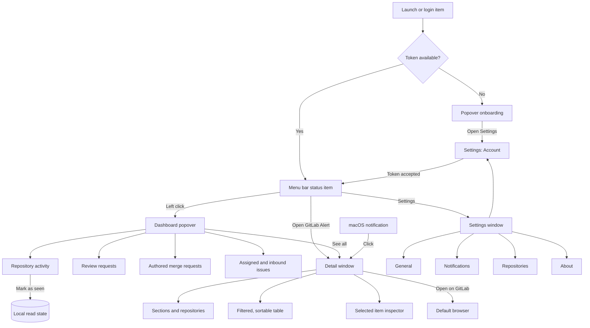
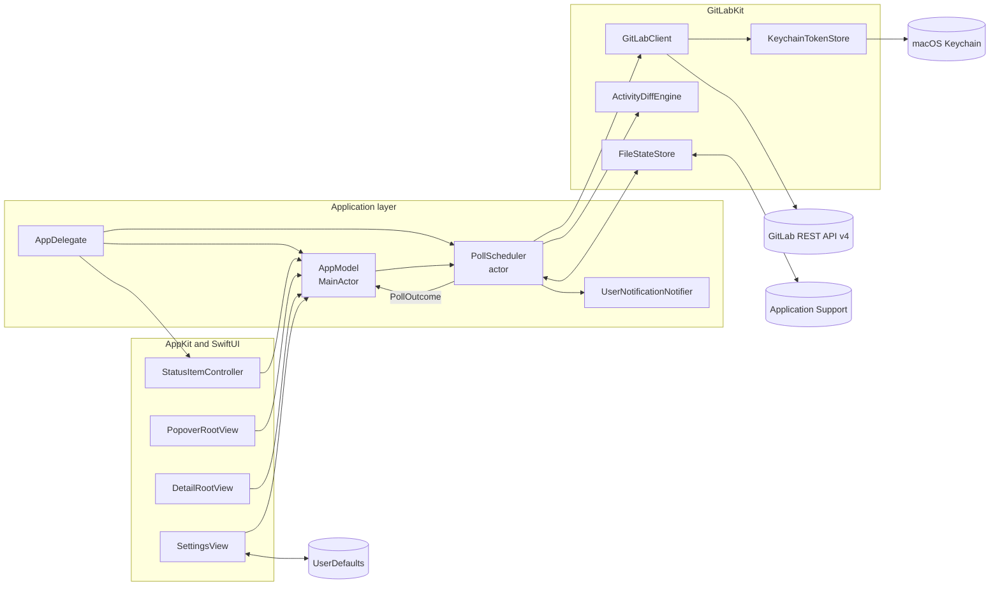

# Architecture

GitLab Alert is a menu bar utility with an AppKit shell and SwiftUI content. It
is split into two modules:

- `GitLabAlert` owns application lifecycle, windows, views, preferences,
  notifications and polling orchestration.
- `GitLabKit` owns the GitLab REST API v4 client, Keychain and file stores,
  models, rate limiting and the pure activity diff engine.

Views depend on the main-actor `AppModel`; no view creates a network client or
writes persistent state directly. `AppDelegate` builds the dependency graph and
owns every AppKit surface.

## Screens and navigation

The application remains an accessory app without a Dock icon. The status item
is its primary entry point; the detail and settings windows are created lazily
and retained only while open.

The popover is optimized for a glance and shows at most five rows per expanded
section. The detail window is the complete workspace: its sidebar chooses the
dataset, its table owns filtering and sorting, and its inspector exposes the
full selected item. A notification click carries an item identifier through
`AppModel.pendingSelection`; the detail view resolves it only after its dataset
exists.

Opening the popover or expanding Activity does not mark events as read. The
user explicitly marks individual activity rows as seen in the popover or one or
more selected rows in the detail table. This changes local presentation only;
it never updates, closes or acknowledges anything on GitLab.

## Runtime and data flow

`PollScheduler` is an actor. It serializes lifecycle changes and joins
simultaneous manual and automatic refresh requests so only one network cycle is
in flight. Sleep, screen sleep and session changes originate in AppKit;
`AppDelegate` forwards them to the scheduler. Network reachability, power state
and whether the popover is open influence the next polling interval.

Each cycle fetches the current user, review requests, authored merge requests,
assigned issues and member projects. Independent requests run concurrently.
List endpoints follow GitLab pagination, while per-project pipeline checks use a
bounded task group. Page size and pipeline concurrency are configurable within
safe limits. The client honors `Retry-After` and exhausted rate-limit floors
before starting another request.

The pure `ActivityDiffEngine` compares the previous and current snapshots. The
first successful cycle establishes a silent baseline. Later cycles create
stable activity records for pipeline transitions and newly observed work. A
snapshot, its watermarks and the resulting activity log are persisted in one
state write before notifications are posted, preventing a crash from replaying
an event on the next launch.

## Persistence and identity

| Data | Storage | Owner |
| --- | --- | --- |
| Personal access token | macOS Keychain | `KeychainTokenStore` |
| GitLab origin and preferences | `UserDefaults` | `Preferences` |
| Last dashboard, watermarks, activity and seen IDs | Application Support JSON | `FileStateStore` |
| Current view and window selection | Memory only | SwiftUI views / `AppModel` |

Seen event identifiers are bounded and persisted with the activity state. An
unresolved GitLab item can therefore stay locally seen across launches. A later
event receives a distinct identifier and becomes unread independently.

Changing the GitLab origin is an account-boundary operation. `AppModel` cancels
in-flight account work, stops and clears the scheduler, deletes the previous
token and creates a new `GitLabClient` for the new origin before accepting a
replacement token. Late responses carry a revision and cannot restore data from
the previous account.

## Security boundaries

- The token is requested with `read_api` only and is sent in GitLab's
  `PRIVATE-TOKEN` header solely to the configured origin.
- Views never receive or read the stored token.
- State files contain dashboard data but no credentials and are replaced
  atomically with owner-only permissions.
- Remote avatar URLs must use HTTPS; other schemes fall back to a local
  monogram.
- GitLab origins hosted below a URL sub-path are currently unsupported.
- The app has no analytics or third-party runtime services.

Stable code signing matters even for local builds because Keychain ACLs and
notification grants are tied to the app's designated requirement. Release
packages use the project's stable self-signed identity. They are signed and
verified but not Apple-notarized. After the first blocked launch, another Mac
must approve the app with **Privacy & Security → Open Anyway**. If Gatekeeper
still blocks the self-signed bundle, the user removes only its quarantine flag
with `xattr -dr com.apple.quarantine "/Applications/GitLabAlert.app"`.
